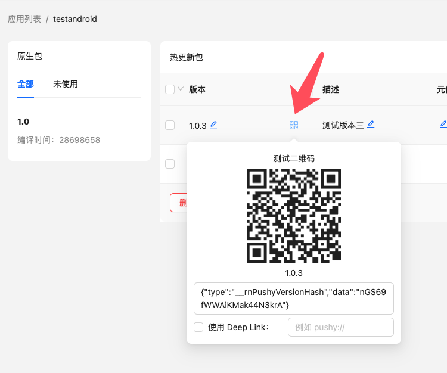

### JavaScript Methods

#### new Cresc(options: CrescOptions)

Creates a Cresc OTA service instance, with the following constructor parameters:

```ts
interface CrescOptions {
  // Required, obtained via cresc createApp/selectApp command or the admin panel
  appKey: string;

  // Custom log output, can also be used to report analytics
  logger?: ({ type, data }: { type: EventType; data: EventData }) => void;

  // Strategy for automatically checking updates
  checkStrategy?:
    | "onAppStart" // Only when app starts
    | "onAppResume" // Only when app switches from background to foreground
    | "both"; // Default, includes both scenarios
    | null; // Do not check for updates automatically, must call checkUpdate manually. Requires v10.4.2+

  // Strategy for downloading and applying updates automatically
  updateStrategy?:
    | "alwaysAlert" // Default in __DEV__, uses system alert to prompt update and show errors
    | "alertUpdateAndIgnoreError" // Default in production, prompts update using system alert, but suppresses error alerts
    | "silentAndNow" // Automatically downloads silently and applies immediately
    | "silentAndLater"; // Automatically downloads silently, but applies only after the user restarts the app
    | null; // Do not download and apply automatically. Choose this if you need a custom UI.

  // Whether to automatically mark as successful after rebooting from an update, default: true
  // Manually marking is generally not recommended
  autoMarkSuccess?: boolean;

  // Whether to clear the last error after several ms, default: do not clear
  dismissErrorAfter?: number;

  // Whether to check for updates in the development environment, default: false. Enable this if you need to debug OTA in dev.
  // Even if enabled, it can only check and download updates, but cannot actually apply them. Applying updates requires a release build.
  // Requires v10.4.2+
  debug?: boolean;

  // Whether to throw an error when calling checkUpdate and downloadUpdate, default: false (get error info via lastError)
  // When enabled, you can use try/catch blocks. lastError will still be available.
  // try {
  //   await checkUpdate();
  // } catch (e) {
  //   console.error(e);
  // }
  // Requires v10.15.2+
  throwError?: boolean;

  // Executed before checking for updates, returning false cancels the check
  // Requires v10.12.0+
  beforeCheckUpdate?: () => Promise<boolean>;

  // Executed before downloading updates, returning false cancels the download. Can be used with custom metaInfo for flow control.
  // Requires v10.12.0+
  beforeDownloadUpdate?: (info: UpdateInfo) => Promise<boolean>;

  // Executed after downloading updates, returning false stops the built-in strategy.
  // Requires v10.27.0+
  afterDownloadUpdate?: (info: UpdateInfo) => Promise<boolean>;

  // Executed when the native package is expired, returning false stops the built-in strategy.
  // Requires v10.28.2+
  onPackageExpired?: (info: UpdateInfo) => Promise<boolean>;
}

// Log event types
type EventType =
  // Update failed, rolled back after reboot
  | "rollback"
  // Error during check
  | "errorChecking"
  // Initiating check
  | "checking"
  // Downloading update
  | "downloading"
  // Download successful
  | "downloadSuccess"
  // Update failed
  | "errorUpdate"
  // Update success
  | "markSuccess"
  // Downloading APK
  | "downloadingApk"
  // User rejected storage permission before downloading APK
  | "rejectStoragePermission"
  // Error requesting storage permission
  | "errorStoragePermission"
  // Error while downloading/installing APK
  | "errorDownloadAndInstallApk";

// Log event data
interface EventData {
  // Hash of the current completed update, empty string if no update applied
  currentVersion: string;
  // Client version info
  cInfo: {
    rnu: string; // react-native-update version
    rn: string; // react-native version
    os: string; // OS and version
    uuid: string; // User identifier
  };
  // Native package version
  packageVersion: string;
  // Build timestamp
  buildTime: number;
  // Error related info
  message?: string;
  // Hash of the rolled-back version
  rolledBackVersion?: string;
  // Hash of the failed new version
  newVersion?: string;
  // Additional data
  [key: string]: any;
}
```

#### useUpdate()

Utility functions for OTA updates. This method can also be imported using the alias `useCresc`.

:::info
Note that `useUpdate` cannot be called directly inside the component that uses `<UpdateProvider>` (typically the root component). It can only be called by its children.
:::

```js
const {
  checkUpdate,
  switchVersion,
  switchVersionLater,
  markSuccess,
  dismissError,
  downloadUpdate,
  downloadAndInstallApk,
  getCurrentVersionInfo,
  currentVersionInfo,
  parseTestQrCode,
  currentHash,
  packageVersion,
  client,
  progress,
  updateInfo,
  lastError,
  restartApp,
} = useUpdate();
```

Types and functionality:

```ts
interface UpdateContext {
  // Checks for updates (Note: Before v10.26.0, `checkUpdate` had no return value, you had to get it from `updateInfo` returned by `useUpdate()`)
  // We still recommend getting `updateInfo` via `useUpdate()` primarily
  checkUpdate: () => Promise<void | UpdateInfo>;
  // Called after download completes to immediately restart and switch to the new version
  switchVersion: () => void;
  // Called after download completes to switch to the new version on the next user-initiated restart (silent update)
  switchVersionLater: () => void;
  // Manually mark update as successful after a restart
  markSuccess: () => void;
  // Clear the last error state
  dismissError: () => void;
  // Download the update. Returns `boolean` in v10.16.0+, indicating success.
  downloadUpdate: () => Promise<boolean | void>;
  // Download and install an APK
  downloadAndInstallApk: (url: string) => Promise<void>;
  // Asynchronously get info about the currently applied update. Use `currentVersionInfo` instead after v10.31.2.
  getCurrentVersionInfo: () => Promise<{
    name?: string;
    description?: string;
    metaInfo?: string;
  }>;
  // Info about the currently applied update. Requires v10.31.2+.
  currentVersionInfo: {
    name?: string;
    description?: string;
    metaInfo?: string;
  };
  // Parse test QR code. Requires v10.11.2+
  parseTestQrCode: (qrCode: string) => void;
  // Current version hash
  currentHash: string;
  // Current native package version
  packageVersion: string;
  // Current Cresc service instance
  client?: Cresc;
  // Progress data after download starts
  progress?: {
    hash: string;
    // Bytes downloaded
    received: number;
    // Total bytes to download
    total: number;
  };
  // Update-related info
  updateInfo?: {
    // Already up-to-date
    upToDate?: true;
    // Native package expired, requires downloading a new native build
    expired?: true;
    // Native package download URL set in the admin console
    downloadUrl?: string;
    // Is there a new update?
    update?: true;
    // New update version name
    name?: string;
    // New update hash
    hash?: string;
    // Update description/changelog
    description?: string;
    // Extra metadata payload
    metaInfo?: string;
    // Is the update currently paused?
    paused?:
      | "app" // Paused for all native versions of the app
      | "package" // Paused for this native version only
      | "quota"; // Paused due to exceeding check quota
    // Other messages
    message?: string;
  };
  // The most recent error occurring during check, download, or apply
  lastError?: Error;
}
```

---

#### async function checkUpdate()

Triggers an update check, returns `updateInfo` (Note: Before v10.26.0, `checkUpdate` had no return value. We still recommend prioritizing `updateInfo` from `useUpdate()`). There are three return scenarios:

1. `{expired: true}`: The native package has expired (3 cases: 1. Manually set as expired, 2. Manually deleted, 3. Never uploaded). You should prompt the user to download a new native build or redirect to the app store (requires setting `downloadUrl` in the web console). To update an APK inside the app, configure [install permissions](/docs/api#async-function-downloadandinstallapkurl).

```js
{
    expired: true,
    downloadUrl: 'http://appstore/downloadUrl',
}
```

2. `{upToDate: true}`: The app is currently up-to-date.

3. `{update: true}`: A new version is available. `name` and `description` can be shown to the user. `metaInfo` can be used to set custom flags (like whether to update silently, or if it's a mandatory update). See [Best Practices](bestpractice#using-meta-info) for details. It also contains download URLs.

```js
{
    update: true,
    name: '1.0.3-rc',
    hash: 'hash',
    description: 'Added Chat feature\nFixed store bugs',
    metaInfo: '{"silent":true}',
    pdiffUrl: 'http://update-packages.reactnative.cn/hash',
    diffUrl: 'http://update-packages.reactnative.cn/hash',
}
```

---

#### async function downloadUpdate()

Downloads the hot update package. Only proceeds if `update:true`. Updates `progress` state. In v10.16.0+, returns `boolean` indicating success.

---

#### async function downloadAndInstallApk(url)

Downloads and directly installs an APK. `url` must point directly to the APK file.

Due to external factors like system security constraints, this is not guaranteed to succeed perfectly. If download/install fails during the app lifecycle, subsequent calls won't retry and fail silently.

Note: Requires manual permissions added to `AndroidManifest.xml`. If supporting pre-Android 7.0 devices, you also need external storage permissions.

```xml
<uses-permission android:name="android.permission.REQUEST_INSTALL_PACKAGES" />

<!-- For pre-Android 7.0 -->
<uses-permission android:name="android.permission.WRITE_EXTERNAL_STORAGE" />
```

Note that some app stores might reject your app due to these permissions. Removing them does not affect OTA update functionality.

---

#### function markSuccess()

**Generally, do not call this manually**. Marks the update as successfully applied (otherwise, the next boot expects a crash and rolls back).

---

#### async function getCurrentVersionInfo()

Gets information about the currently active hot update (returns an empty object if no update was applied). Use `currentVersionInfo` instead after v10.31.2.

Example return:

```js
{
    name: '1.0.3-rc',
    description: 'Added Chat feature\nFixed store bugs',
    metaInfo: '{"silent":true}',
}
```

---

#### function restartApp()

Immediately restarts the application. Available in v10.28.2+.

---

#### function switchVersion()

Immediately restarts the app and loads the newly downloaded version.

> Warning! Do not rely solely on `progress` to determine download completion! Call this strictly after `await downloadUpdate()` finishes.

---

#### function switchVersionLater()

Loads the newly downloaded version on the next natural app restart.

> Warning! Call this strictly after `await downloadUpdate()` finishes.

---

#### function parseTestQrCode(qrCode: string)

Parses test QR codes, typically used by QA to test OTA packages. If your app already has a scanning feature, scan Cresc QRs to preview arbitrary update versions.
Note: If using custom update strategies, rely exclusively on `updateInfo` from `useUpdate()` because the QR code scan bypasses checkUpdate's return value.



When using this method, **do not** check the "Use Deep Link" option.

Example:

```js
<Camera
  onReadCode={({ nativeEvent: { codeStringValue } }) => {
    // Disable camera upon read
    setShowCamera(false);
    // Parse test QR first
    if (parseTestQrCode(codeStringValue)) {
      // If it's a Cresc QR, stop processing
      return;
    }
    // Otherwise, process normal business logic
  }}
/>
```

---

### Android Methods

#### UpdateContext.setCustomInstanceManager(ReactInstanceManager instanceManager)

If integrating into an existing Android host app, pass your custom ReactInstanceManager here. Available since `v5.5.8`.

Example:

```java
import cn.reactnative.modules.update.UpdateContext

mReactInstanceManager = ReactInstanceManager.builder()
                // ...other setters, but do NOT call setBundleAssetName
                .setJSBundleFile(UpdateContext.getBundleUrl(mContext, "assets://index.android.bundle"))
                .build();
UpdateContext.setCustomInstanceManager(mReactInstanceManager);
```
