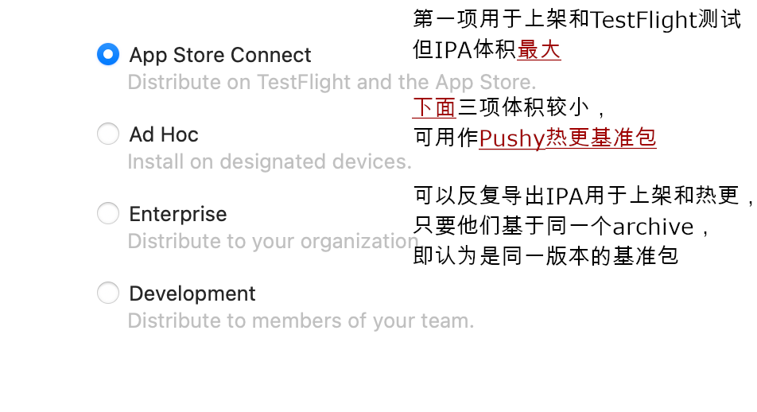
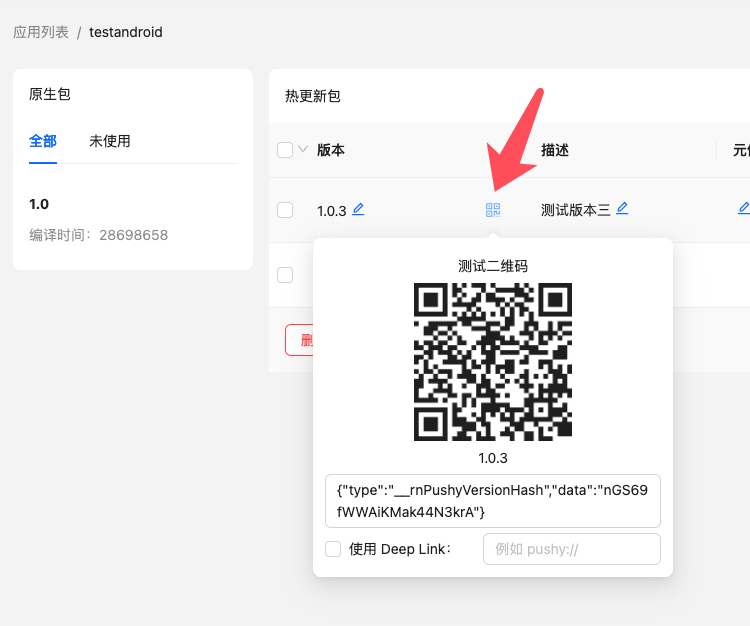

#### Optimizing Native and Hot Update Package Size

##### iOS Native Package Optimization (ipa)

For the same archive (where version number, build time, and bundled js are fixed and unaffected by the export method), you can export the ipa multiple times with different options and choose the smallest one to upload to the Cresc server as your update baseline.



##### Android Native Package Optimization (apk)

APK optimization primarily focuses on two areas:

- [Enable Proguard to obfuscate and shrink code](https://reactnative.dev/docs/signed-apk-android#enabling-proguard-to-reduce-the-size-of-the-apk-optional). Note that this step might cause runtime errors for code using reflection. Exhaustive testing is required after enabling, and you might need to add specific Proguard rules for third-party libraries.
- [Build separate APKs for different CPU architectures](https://reactnative.dev/docs/signed-apk-android#building-separate-apks-for-different-cpu-architectures-optional). Find the CPU architecture section in `android/app/build.gradle` and enable the `enableSeparateBuildPerCPUArchitecture` option as shown below:

```diff
splits {
    abi {
        reset()
-       enable enableSeparateBuildPerCPUArchitecture
+       enable true        // Enable separate CPU architecture builds
        universalApk false  // If true, also generate a universal APK
    }
}
```

This will output multiple APK files in the build directory. For distribution and uploading to the hot update service, you only need to use the `app-arm64-v8a-release.apk` file, which significantly reduces the APK size.

##### Hot Update Package Optimization (ppk)

The primary content of a hot update package is the JS bundle and its referenced static assets (mostly images).

- **JS Bundle Analysis**: You can use third-party tools (like [react-native-bundle-visualizer](https://github.com/IjzerenHein/react-native-bundle-visualizer)) to analyze which modules consume the most space in your JS files, and see if they can be replaced with lighter alternatives (e.g., replacing `moment` with `dayjs`, or `lodash` with `lodash-es`).
- **Image Optimization**:
  - Use compression tools to crop and compress images without noticeable quality loss.
  - If transparent pixels aren't needed, consider converting PNG formats to JPG.
  - Consider image formats with higher compression ratios, such as WEBP (requires third-party native plugins like [react-native-webp-format](https://github.com/Aleksefo/react-native-webp-format#readme)) or HEIF (supported natively on iOS 11 and Android 10+). Here is an image format comparison for reference: <https://compare.rokka.io/_compare/#heif=40&jpeg=80&webp=80&av1=40&width=800>.

#### Handling Multiple Channel APKs for Hot Updates

1. If the channel APKs have differences in their `JS code or initial assets` (no matter how slight, which results in different jsbundles), you must build separate APKs, upload, and bind them individually. You can write scripts to automate bulk operations using the CLI.
2. If the `JS code and initial assets` across channel APKs are perfectly identical, consider using [Flavor builds](https://developer.android.com/studio/build/build-variants), or other dynamic channel generation tools (like [Tencent's VasDolly](https://github.com/Tencent/VasDolly) or [Meituan's walle](https://github.com/Meituan-Dianping/walle)). In this approach, all channel APKs are generated from a single base APK (thus sharing the same build timestamp and jsbundle). This means you only need to upload one base APK, and hot updates applied to it will take effect across all channel APKs.
3. If you are on the `Premium`, `Professional`, or `Enterprise VIP` plans, you can enable `Ignore Build Timestamp` in your app settings in the admin dashboard. This option only checks the version number and ignores the timestamp, providing a wider tolerance for updates, but it may consume more CDN traffic.

#### Supporting the AAB Format

Update the `react-native-update-cli` to v2.6.0 or higher. You can then use the `cresc parseAab` and `cresc uploadAab` commands for `.aab` format support.

#### Testing and Rollbacks

Starting from version v10.11.2, you can use two quick QR code scanning methods to test hot updates without needing to bind them beforehand:



- **If your app has [Deep Linking](https://reactnative.dev/docs/linking#enabling-deep-links) enabled:**

No code changes are required. Simply check "Use Deep Link" in the interface shown above, enter your app's scheme (e.g., `cresc://`), and scan the QR code using your system camera or built-in scanner (Do not use WeChat's scanner). The app will automatically open and trigger the update.

- **If your app has a built-in barcode scanner:**

Please refer to the documentation for the [parseTestQrCode](api#function-parsetestqrcodeqrcode-string) method.

<details>
<summary>If your app doesn't have either feature, or your Cresc version is below v10.11.2, use this test setup (Not Recommended)</summary>

Publish an **internal test package**, and then publish a **production package** that is identical in every way except the version number.

For example, assuming your production package version is `1.6.0`, you can modify it to `1001.6.0` to clearly indicate it's a test version, while the matching ending digits indicate it is related to a specific production release (identical content/dependencies).

Before pushing any hot update to the production package, always perform the update operation targeting the **test package** `1001.6.0`. Once testing passes, you can then re-bind that hot update package to the **production package** `1.6.0` in the web console. If major issues are found in the test package, you can fix them, test again, and only deploy securely to production when ready. This maximally prevents live accidents.

</details>

If your testing native package already has a published hot update and its strategy is set to "Apply Immediately", this might conflict with QR code scanning (e.g., immediately overriding the QR code preview with the published version). To prevent this, you can use the `beforeCheckUpdate` callback to temporarily disable update checks after scanning a QR code until the next restart.

```js
// The isFirstTimeDebug flag is available in v10.37.0+, indicating the first boot after a QR OTA
import { isFirstTimeDebug } from 'react-native-update/src/core';

const crescClient = new Cresc({
  beforeCheckUpdate: async () => {
    if (isFirstTimeDebug) {
      // If this is the first boot after a QR test update, skip remote checks
      return false;
    }
    return true;
  },
})
```

In the worst-case scenario where a production crash happens and requires a rollback, immediately set the native package or the whole app's hot update status to 'Paused', then re-bind it to a previously healthy version. Alternatively, use your VCS to revert code to a healthy state and generate and push a new hot update package.

#### Using Meta Info

When publishing a hot update version, or via the web console, you can edit the version's meta info. This is a customizable payload string obtained during the update check. You can format it however you like (we strongly recommend [JSON format](https://developer.mozilla.org/en-US/docs/Learn/JavaScript/Objects/JSON)) to store additional payload data.

For example, we might define a `silent` flag indicating whether an update should be completely silent. When uploading the hot update package, we put this in the meta info field in JSON format:

```json
{ "silent": true }
```

> Note: We do not enforce any format validation or restrictions on this input. Please validate it yourself.

When the client checks for updates, it receives this meta info chunk, but it doesn't automatically trigger any logic—it's just a payload string. Thus, we need to **preemptively** integrate handling logic into our update flow:

```js
// Call useUpdate() to get updateInfo
if (updateInfo.expired) {
  // ... Native package expired, download or prompt redirect 
} else if (updateInfo.upToDate) {
  // ... No updates
} else {
  // An update is available. Usually, we display an alert here to ask the user.
  // A 'silent' update essentially means skipping the alert, so we inject logic here.
  // ...
}
```

We can splice meta-info reading and conditional logic into the standard flow:

```js
let metaInfo = {};
try {
  // JSON inputs might be malformed, always wrap in try-catch to avoid app crashes
  metaInfo = JSON.parse(updateInfo.metaInfo);
} catch (e) {
  // Handle exceptions, ignore or report?
}

if (metaInfo.silent) {
  // If the payload specifies silent: true, skip user prompts and apply directly
  switchVersion();
} else {
  // Otherwise, use the traditional prompt workflow
  // Alert.alert('Notice', 'A new version is available.......
}
```

As another example, a specific version might include major announcements, so you could insert an `announcement` field in the payload to render. How you use meta info is entirely constrained.
