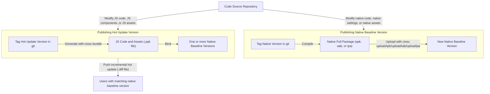

Now that your app can detect updates, let's learn how to publish and update it. See the flow below:



1. We first need to build a native release version. Before building, ensure `react-native-update` is integrated, tested, and works correctly. For Android, [disable `crunchPngs`](/docs/getting-started#disabling-android-image-crunch-operations). See documentation for [iOS Build](https://reactnative.dev/docs/publishing-to-app-store) and [Android Build](https://reactnative.dev/docs/signed-apk-android). After building, run `cresc uploadIpa`, `cresc uploadApk`, or `cresc uploadAab` to upload the package to Cresc servers to serve as the baseline for delta comparisons. Keep a copy of this installation package; the package distributed to users `must be strictly identical` to the uploaded one. We recommend using git tags for native versioning (e.g., `v1.0.0`).
2. Iterate on your business logic over the baseline (add/remove JS code, static assets). Run `cresc bundle` to generate and publish a hot update without recompiling the native app. We recommend using git tags for hot update versioning (e.g., `v1.0.1`).
3. If there are native changes during iteration, you must publish and upload a new native baseline version (repeat step 1, but set a different native version number). You can maintain just one native baseline or multiple versions concurrently.

## Publishing Native Baseline Version

### iOS

Refer to [Running On Device](https://reactnative.dev/docs/running-on-device) to ensure you are using the offline bundle. 

Follow the standard flow to archive the `.ipa` file:

1. In Xcode, select a real device or Generic iOS Device.
2. Go to Product - Archive.
3. After Archiving, select `Export` to generate the .ipa file.
4. Run the following command to upload it:

```bash
$ cresc uploadIpa <my_ipa_file.ipa>
```

The `CFBundleShortVersionString` in `ios/[project]/Info.plist` will be recorded as the `packageVersion`.

You can now upload this version to the App Store, or test it on devices via TestFlight. Note: Testing hot updates directly via Xcode is not supported yet.

If you re-archive later (e.g., modifying native code/configs), you must **change the version number**, and `uploadIpa` again. Otherwise, identically versioned native packages can produce [mismatched build timestamps](/docs/faq#why-do-mismatched-build-timestamps-affect-update-performance), which do not block updates but can reduce diff reuse and increase download size.

### Android

Set up signing per [Android Signed APK](https://reactnative.dev/docs/signed-apk-android). Run `./gradlew assembleRelease` or `./gradlew aR` in the `android` folder. The APK will be under `android/app/build/outputs/apk/release/app-release.apk`.

If you need to distribute `.aab` to Google Play and `.apk` to other channels, add an npm script to the root `package.json` that runs `assembleRelease` and `bundleRelease` in the same Gradle invocation. This lets the APK and AAB reuse the same release build outputs, keeping the embedded bundle and build timestamp aligned. You can then distribute the format required by each channel. If your project already has a `scripts` field, add only this script:

```json
{
  "scripts": {
    "package:android:release": "cd android && ./gradlew clean assembleRelease bundleRelease"
  }
}
```

```bash
$ npm run package:android:release
```

The outputs are:

```text
android/app/build/outputs/apk/release/app-release.apk
android/app/build/outputs/bundle/release/app-release.aab
```

If your project uses flavors, adjust the task names in the npm script for the actual variant, for example `assembleProdRelease` and `bundleProdRelease`. Avoid running `assembleRelease` in one Gradle command and `bundleRelease` in another, because the two packages may end up with different build timestamps.

Upload the format you actually distribute:

```bash
$ cresc uploadApk android/app/build/outputs/apk/release/app-release.apk
# If you actually distribute an .aab package, use:
$ cresc uploadAab android/app/build/outputs/bundle/release/app-release.aab
```

The `versionName` in `android/app/build.gradle` is recorded as the `packageVersion`.

You can now publish this version to app markets or install the APK directly for testing. If the same version produced both APK and AAB, distribute the format required by each channel: Google Play usually uses AAB, while direct install and third-party markets commonly use APK.

If you rebuild native code later, you must **change the version number**, and upload the corresponding native package again. Otherwise, [build timestamp mismatches](/docs/faq#why-do-mismatched-build-timestamps-affect-update-performance) do not block updates but can reduce diff reuse and increase download size.

## Publishing Hot Update Version

Modify a line of code, and run `cresc bundle --platform <ios|android>` to generate a new hot update version.

:::info
If you use frameworks without `index.js` like modern `expo`, the `bundle` command will fail. Manually create an `index.js` file importing the framework's entry file, referring to `main` in `package.json`. For `expo`, `index.js` looks like:

```js
import "expo-router/entry";
```
:::

```bash
$ cresc bundle --platform android
Bundling with React Native version:  0.22.2
<various progress output>
Bundled saved to: build/output/android.1459850548545.ppk
Would you like to publish it?(Y/N)
```

Input Y to upload immediately, or run `cresc publish --platform android build/output/android.1459850548545.ppk` later.

```
  Uploading [========================================================] 100% 0.0s
Enter version name: <Enter hot update name, e.g., 1.0.0-rc>
Enter description: <Enter details>
Enter meta info: {"ok":1}
Ok.
Would you like to bind packages to this version?(Y/N)
```

The version is stored on the server, but users cannot see it until you bind native packages to it.
Input Y to bind immediately, or run `cresc update --platform <ios|android>` later to bind previously uploaded versions. You can also drag and drop native versions to matching hot updates on the web dashboard.

```
┌────────────┬──────────────────────────────────────┐
│ Package Id │               Version                │
├────────────┼──────────────────────────────────────┤
│   46272    │ 2.0(normal)                          │
├────────────┼──────────────────────────────────────┤
│   45577    │ 1.0(normal)                          │
└────────────┴──────────────────────────────────────┘
Total 2 packages
Enter package id: 46272
```

After binding, the server takes a few seconds to generate diff patches, and clients will receive updates.
To publish new updates thereafter, repeatedly run `cresc bundle` without recompiling native code.
Congratulations! You have completed the hot update integration.

## Canary Release (Gradual Rollout)

Canary releases mitigate risk by gradually expanding the update scope to test stability.

### What is a Canary Release?

Before pushing updates globally, you push them to a small subset (e.g., 5%, 10%) of users, observe their metrics, and gradually widen the scope to 100%.

### Benefits

- **Lower Risk**: Bugs only affect small subsets, enabling swift rollbacks.
- **Verify Stability**: Observe performance across varied real-world networking environments.
- **Smooth Transitions**: Prevents severe server CPU usage spikes during mass updates.
- **Fast Recovery**: Halts rollouts immediately minimizing global impact.

### How it Works

When you configure a canary percentage (e.g., 10%), update queries calculate a hash using the device's UUID:

- Users within the bucket receive the newest updates.
- Users outside receive the previous full version or no update.
- The hash remains stable; multiple checks won't flip a user's bucket state.

### Usage

#### Web Dashboard

1. Log into the Cresc Dashboard.
2. Select App and Native Version.
3. Click "Publish".
4. Adjust the rollout percentage.

#### Command Line

Review the [rollout parameter in the CLI docs](/docs/cli#cresc-update).

### Notes

:::warning
**Important**: Canary versions form independent bindings with Native packages.
:::

- **One Canary Version At A Time**: Each Native Version can bind to one Canary update (&lt;100%) and one Full update concurrently.
- **Priority**: Users inside the canary bucket receive the canary update. Others receive the Full update.
- **Promoting to Full**: Bumping the percentage to 100% promotes the canary to a full release automatically, replacing any older full releases.
- **Client Requirements**: Features require `react-native-update` >= 10.32.0.
